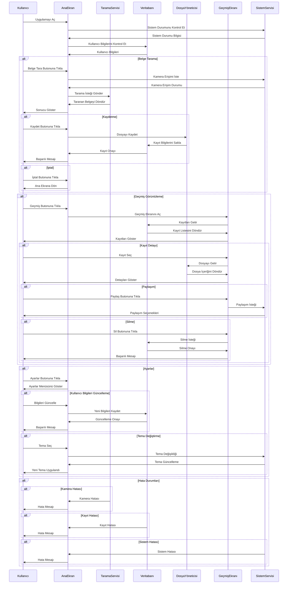

```mermaid
sequenceDiagram
    participant K as Kullanıcı
    participant A as AnaEkran
    participant T as TaramaServisi
    participant V as Veritabanı
    participant D as DosyaYöneticisi
    participant G as GeçmişEkranı
    participant S as SistemServisi

    K->>A: Uygulamayı Aç
    A->>S: Sistem Durumunu Kontrol Et
    S->>A: Sistem Durumu Bilgisi
    A->>V: Kullanıcı Bilgilerini Kontrol Et
    V->>A: Kullanıcı Bilgileri
    
    alt Belge Tarama
        K->>A: Belge Tara Butonuna Tıkla
        A->>S: Kamera Erişimi İste
        S->>A: Kamera Erişim Durumu
        A->>T: Tarama İsteği Gönder
        T->>A: Taranan Belgeyi Döndür
        A->>K: Sonucu Göster
        
        alt Kaydetme
            K->>A: Kaydet Butonuna Tıkla
            A->>D: Dosyayı Kaydet
            D->>V: Kayıt Bilgilerini Sakla
            V->>A: Kayıt Onayı
            A->>K: Başarılı Mesajı
        end

        alt İptal
            K->>A: İptal Butonuna Tıkla
            A->>K: Ana Ekrana Dön
        end
    end

    alt Geçmiş Görüntüleme
        K->>A: Geçmiş Butonuna Tıkla
        A->>G: Geçmiş Ekranını Aç
        G->>V: Kayıtları Getir
        V->>G: Kayıt Listesini Döndür
        G->>K: Kayıtları Göster
        
        alt Kayıt Detayı
            K->>G: Kayıt Seç
            G->>D: Dosyayı Getir
            D->>G: Dosya İçeriğini Döndür
            G->>K: Detayları Göster

            alt Paylaşım
                K->>G: Paylaş Butonuna Tıkla
                G->>S: Paylaşım İsteği
                S->>K: Paylaşım Seçenekleri
            end

            alt Silme
                K->>G: Sil Butonuna Tıkla
                G->>V: Silme İsteği
                V->>G: Silme Onayı
                G->>K: Başarılı Mesajı
            end
        end
    end

    alt Ayarlar
        K->>A: Ayarlar Butonuna Tıkla
        A->>K: Ayarlar Menüsünü Göster
        
        alt Kullanıcı Bilgileri Güncelleme
            K->>A: Bilgileri Güncelle
            A->>V: Yeni Bilgileri Kaydet
            V->>A: Güncelleme Onayı
            A->>K: Başarılı Mesajı
        end

        alt Tema Değiştirme
            K->>A: Tema Seç
            A->>S: Tema Değişikliği
            S->>A: Tema Güncelleme
            A->>K: Yeni Tema Uygulandı
        end
    end

    alt Hata Durumları
        alt Kamera Hatası
            T->>A: Kamera Hatası
            A->>K: Hata Mesajı
        end

        alt Kayıt Hatası
            V->>A: Kayıt Hatası
            A->>K: Hata Mesajı
        end

        alt Sistem Hatası
            S->>A: Sistem Hatası
            A->>K: Hata Mesajı
        end
    end
``` 