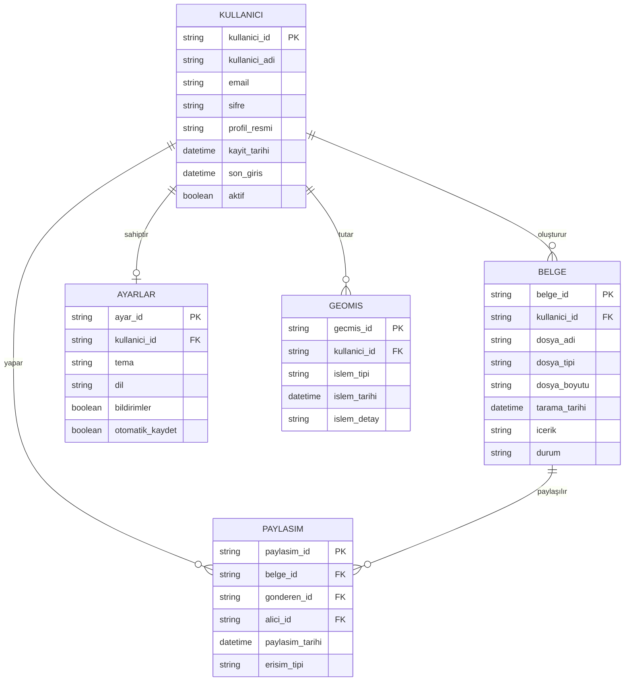

```mermaid
erDiagram
    KULLANICI {
        string kullanici_id PK
        string kullanici_adi
        string email
        string sifre
        string profil_resmi
        datetime kayit_tarihi
        datetime son_giris
        boolean aktif
    }

    BELGE {
        string belge_id PK
        string kullanici_id FK
        string dosya_adi
        string dosya_tipi
        string dosya_boyutu
        datetime tarama_tarihi
        string icerik
        string durum
    }

    AYARLAR {
        string ayar_id PK
        string kullanici_id FK
        string tema
        string dil
        boolean bildirimler
        boolean otomatik_kaydet
    }

    PAYLASIM {
        string paylasim_id PK
        string belge_id FK
        string gonderen_id FK
        string alici_id FK
        datetime paylasim_tarihi
        string erisim_tipi
    }

    GEOMIS {
        string gecmis_id PK
        string kullanici_id FK
        string islem_tipi
        datetime islem_tarihi
        string islem_detay
    }

    KULLANICI ||--o{ BELGE : "oluşturur"
    KULLANICI ||--o| AYARLAR : "sahiptir"
    KULLANICI ||--o{ PAYLASIM : "yapar"
    KULLANICI ||--o{ GEOMIS : "tutar"
    BELGE ||--o{ PAYLASIM : "paylaşılır"

    %% İlişki Açıklamaları
    %% KULLANICI-BELGE: Bir kullanıcı birden çok belge oluşturabilir
    %% KULLANICI-AYARLAR: Her kullanıcının bir ayar kaydı vardır
    %% KULLANICI-PAYLASIM: Bir kullanıcı birden çok paylaşım yapabilir
    %% KULLANICI-GEOMIS: Bir kullanıcının birden çok geçmiş kaydı olabilir
    %% BELGE-PAYLASIM: Bir belge birden çok kez paylaşılabilir
``` 