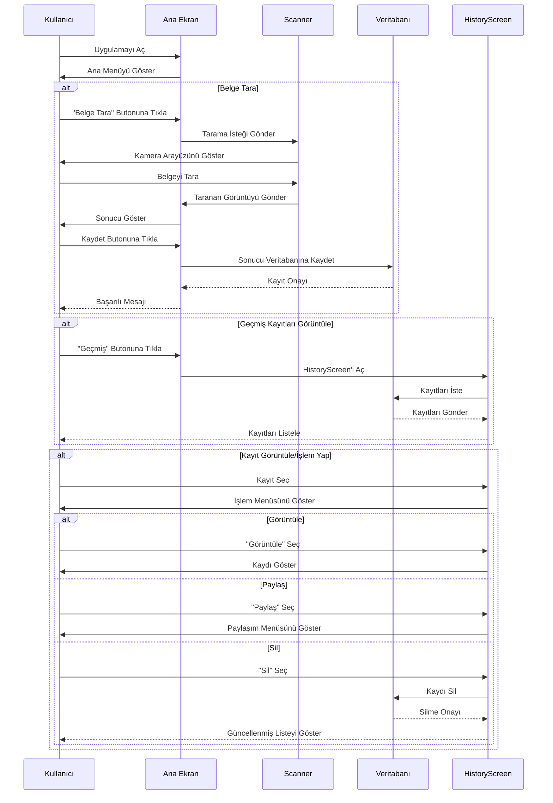

```mermaid
sequenceDiagram
    participant K as Kullanıcı
    participant A as Ana Ekran
    participant S as Scanner
    participant DB as Veritabanı
    participant H as HistoryScreen

    K->>A: Uygulamayı Aç
    A->>K: Ana Menüyü Göster

    alt Belge Tara
        K->>A: "Belge Tara" Butonuna Tıkla
        A->>S: Tarama İsteği Gönder
        S->>K: Kamera Arayüzünü Göster
        K->>S: Belgeyi Tara
        S->>A: Taranan Görüntüyü Gönder
        A->>K: Sonucu Göster
        K->>A: Kaydet Butonuna Tıkla
        A->>DB: Sonucu Veritabanına Kaydet
        DB-->>A: Kayıt Onayı
        A-->>K: Başarılı Mesajı
    end

    alt Geçmiş Kayıtları Görüntüle
        K->>A: "Geçmiş" Butonuna Tıkla
        A->>H: HistoryScreen'i Aç
        H->>DB: Kayıtları İste
        DB-->>H: Kayıtları Gönder
        H-->>K: Kayıtları Listele
    end

    alt Kayıt Görüntüle/İşlem Yap
        K->>H: Kayıt Seç
        H->>K: İşlem Menüsünü Göster
        alt Görüntüle
            K->>H: "Görüntüle" Seç
            H->>K: Kaydı Göster
        else Paylaş
            K->>H: "Paylaş" Seç
            H->>K: Paylaşım Menüsünü Göster
        else Sil
            K->>H: "Sil" Seç
            H->>DB: Kaydı Sil
            DB-->>H: Silme Onayı
            H-->>K: Güncellenmiş Listeyi Göster
        end
    end
``` 