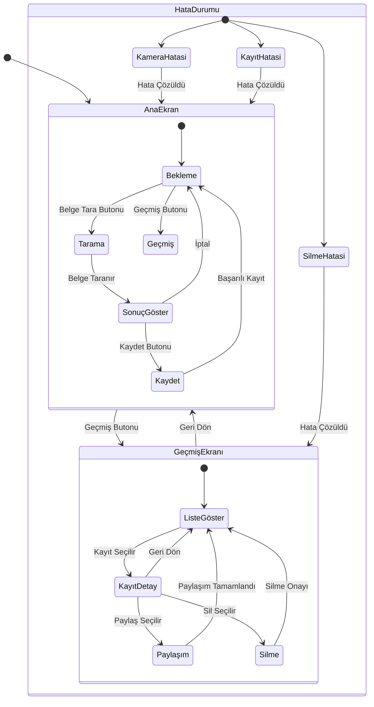

```mermaid
stateDiagram-v2
    [*] --> AnaEkran
    
    state AnaEkran {
        [*] --> Bekleme
        Bekleme --> Tarama: Belge Tara Butonu
        Bekleme --> Geçmiş: Geçmiş Butonu
        Tarama --> SonuçGöster: Belge Taranır
        SonuçGöster --> Bekleme: İptal
        SonuçGöster --> Kaydet: Kaydet Butonu
        Kaydet --> Bekleme: Başarılı Kayıt
    }
    
    state GeçmişEkranı {
        [*] --> ListeGöster
        ListeGöster --> KayıtDetay: Kayıt Seçilir
        KayıtDetay --> ListeGöster: Geri Dön
        KayıtDetay --> Paylaşım: Paylaş Seçilir
        KayıtDetay --> Silme: Sil Seçilir
        Silme --> ListeGöster: Silme Onayı
        Paylaşım --> ListeGöster: Paylaşım Tamamlandı
    }
    
    AnaEkran --> GeçmişEkranı: Geçmiş Butonu
    GeçmişEkranı --> AnaEkran: Geri Dön
    
    state HataDurumu {
        [*] --> KameraHatasi
        [*] --> KayıtHatasi
        [*] --> SilmeHatasi
        KameraHatasi --> AnaEkran: Hata Çözüldü
        KayıtHatasi --> AnaEkran: Hata Çözüldü
        SilmeHatasi --> GeçmişEkranı: Hata Çözüldü
    }
``` 